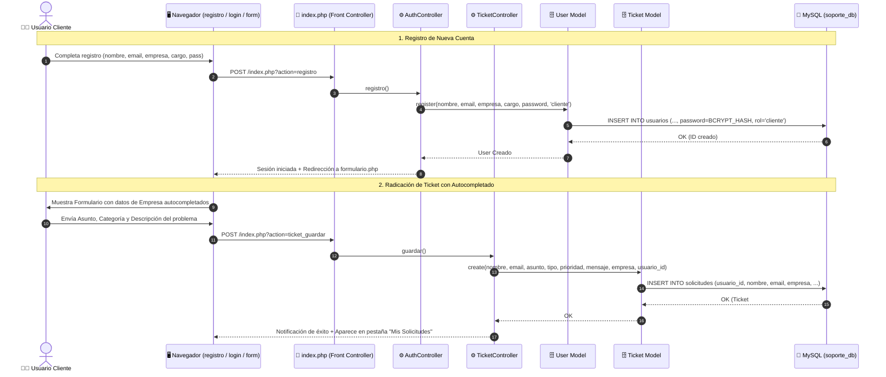

# 🏛️ Diagrama de Arquitectura del Sistema TechCare Soporte TI
**Proyecto:** TechCare Soporte TI — Mesa de Ayuda Inteligente con IA Generativa y Analítica Predictiva  
**Patrón Arquitectónico:** MVC (Modelo - Vista - Controlador) + Capa de Servicios Híbrida (Cloud / Local) + Control de Acceso por Roles (RBAC)  
**Versión:** 2.2.0  

---

## 1. Diagrama de Arquitectura de Capas (Mermaid)

Este diagrama representa cómo interactúan las capas de la aplicación, desde la interfaz de usuario (Clientes y Administradores) hasta los motores de inteligencia artificial y la base de datos:

```mermaid
flowchart TB
    subgraph CLIENTE["🌐 Capa de Presentación (Frontend)"]
        UI_REG["Módulo de Registro de Clientes<br/>(views/registro.php)"]
        UI_LOGIN["Módulo de Autenticación Unificado<br/>(views/login.php)"]
        UI_USER["Portal de Radicación & Historial<br/>(views/formulario.php)"]
        UI_ADMIN["Dashboard Gerencial & KPIs<br/>(views/dashboard.php)"]
        UI_MODAL["Modal Copiloto IA<br/>(views/partials/modal_ia.php)"]
        ASSETS["Assets & Scripts<br/>(CSS Glassmorphism / JS Fetch / Chart.js)"]
    end

    subgraph ROUTER["🔀 Capa de Enrutamiento (Front Controller)"]
        INDEX["index.php<br/>(Router / Dispatcher / RBAC Middleware)"]
    end

    subgraph CONTROLLERS["⚙️ Capa de Controladores (Application Logic)"]
        AUTH_CTRL["AuthController.php<br/>• Registro de Usuarios Clientes<br/>• Login / Logout con Redirección por Rol<br/>• Middleware requireAdmin() & requireAuth()"]
        TICKET_CTRL["TicketController.php<br/>• Crear Solicitudes vinculadas a Usuario/Empresa<br/>• Actualizar Estados (Pendiente/Proceso/Resuelto)"]
        IA_CTRL["IAController.php<br/>• Despacho Diagnóstico de Incidentes<br/>• Dictámenes y Analítica Estratégica Directiva"]
    end

    subgraph SERVICES["🧠 Capa de Servicios de Inteligencia Artificial"]
        GEMINI_SRV["GeminiService.php<br/>• Google Gemini 3.x Flash Cloud<br/>• Auto-Recuperación de Modelos"]
        LOCAL_SRV["LocalExpertService.php<br/>• Motor Heurístico Semántico (NLP)<br/>• 0 Tokens / Respuesta Instantánea"]
    end

    subgraph MODELS["🗄️ Capa de Datos (Modelos DAO / Active Record)"]
        USER_MDL["User.php<br/>• Autenticación BCRYPT<br/>• Gestión de Clientes, Técnicos y Admins<br/>• Registro con Empresa y Cargo"]
        TICKET_MDL["Ticket.php<br/>• CRUD Solicitudes con auto-migración<br/>• Filtros por Usuario y Agregación de Métricas SQL"]
    end

    subgraph STORAGE["💾 Capa de Persistencia & Servicios Externos"]
        MYSQL[("MySQL / MariaDB<br/>soporte_db<br/>(tablas: usuarios / solicitudes)")]
        GEMINI_CLOUD["☁️ Google AI Studio<br/>Gemini REST API (Cloud)"]
    end

    %% Relaciones de Flujo
    CLIENTE -->|HTTP GET / POST| INDEX
    INDEX -->|Rutas de Registro / Auth| AUTH_CTRL
    INDEX -->|Rutas de Tickets| TICKET_CTRL
    INDEX -->|Rutas de IA| IA_CTRL

    AUTH_CTRL -->|Registrar / Autenticar| USER_MDL
    TICKET_CTRL -->|Guardar / Listar / Historial| TICKET_MDL
    IA_CTRL -->|Consultas IA Cloud (Bajo Demanda)| GEMINI_SRV
    IA_CTRL -->|Consultas IA Local (Instantáneo)| LOCAL_SRV
    IA_CTRL -->|Guardar Solución JSON| TICKET_MDL

    GEMINI_SRV -->|HTTPS REST cURL| GEMINI_CLOUD
    GEMINI_SRV -.->|Fallback si falla API| LOCAL_SRV

    USER_MDL -->|SQL Prepared Stmt| MYSQL
    TICKET_MDL -->|SQL Prepared Stmt| MYSQL
```

---

## 2. Descripción de Componentes por Capa

### A. Capa de Presentación (Frontend)
* **Tecnologías:** HTML5 semántico, CSS3 personalizado con efectos Glassmorphism, Bootstrap 5.3, Bootstrap Icons y Chart.js 4.4.
* **Componentes:**
  * `registro.php`: Formulario de registro para nuevos usuarios clientes con captura de nombre, correo, empresa, cargo y contraseña.
  * `login.php`: Pantalla de inicio de sesión con soporte para múltiples perfiles y redirección automática según rol.
  * `formulario.php`: Portal con doble funcionalidad (Pestaña 1: Radicación de Tickets con datos autocompletados; Pestaña 2: Historial de "Mis Solicitudes" con estados y respuestas de IA).
  * `dashboard.php`: Panel directivo protegido para Administradores/Técnicos con KPIs, gráficos dinámicos y tabla de gestión.
  * `modal_ia.php`: Ventana modal para visualizar causas raíz, planes de acción técnicos y comandos ejecutables.

### B. Capa de Enrutamiento y Controladores (Backend)
* **`index.php` (Front Controller):** Punto único de entrada que despacha rutas y aplica control de acceso por roles (RBAC).
* **`AuthController`:** Coordina el registro seguro de cuentas con hash BCRYPT, autenticación de sesiones y protección de endpoints administrativos (`requireAdmin()`).
* **`TicketController`:** Valida la integridad de las solicitudes, vincula automáticamente el `usuario_id` y `empresa` del solicitante y actualiza estados de trabajo.
* **`IAController`:** Gestiona el modo híbrido de IA (Motor Local por defecto para carga ultrarrápida a 0 tokens, y Google Gemini Cloud bajo demanda).

### C. Capa de Servicios de IA (Arquitectura Híbrida)
* **`GeminiService` (Cloud):** Conexión HTTPS cURL con la API de Google Generative Language (`gemini-3.7-flash` / `gemini-3.1-pro-preview`).
* **`LocalExpertService` (Offline / 0 Tokens):** Analizador semántico NLP con 7 sub-dominios (M365, Redes/VPN, Ciberseguridad, Bases de Datos, Servidores, Hardware, Software ERP).
* **Resiliencia & Fallback:** Conmutación automática a local ante cualquier fallo de red o agotamiento de cuotas.

### D. Capa de Modelos y Datos
* **`Ticket` & `User`:** Clases Active Record con auto-migración de esquema y consultas preparadas (`prepared statements`) que garantizan seguridad contra SQL Injection.

---

## 3. Diagrama de Secuencia: Registro, Autenticación y Radicación de Ticket


