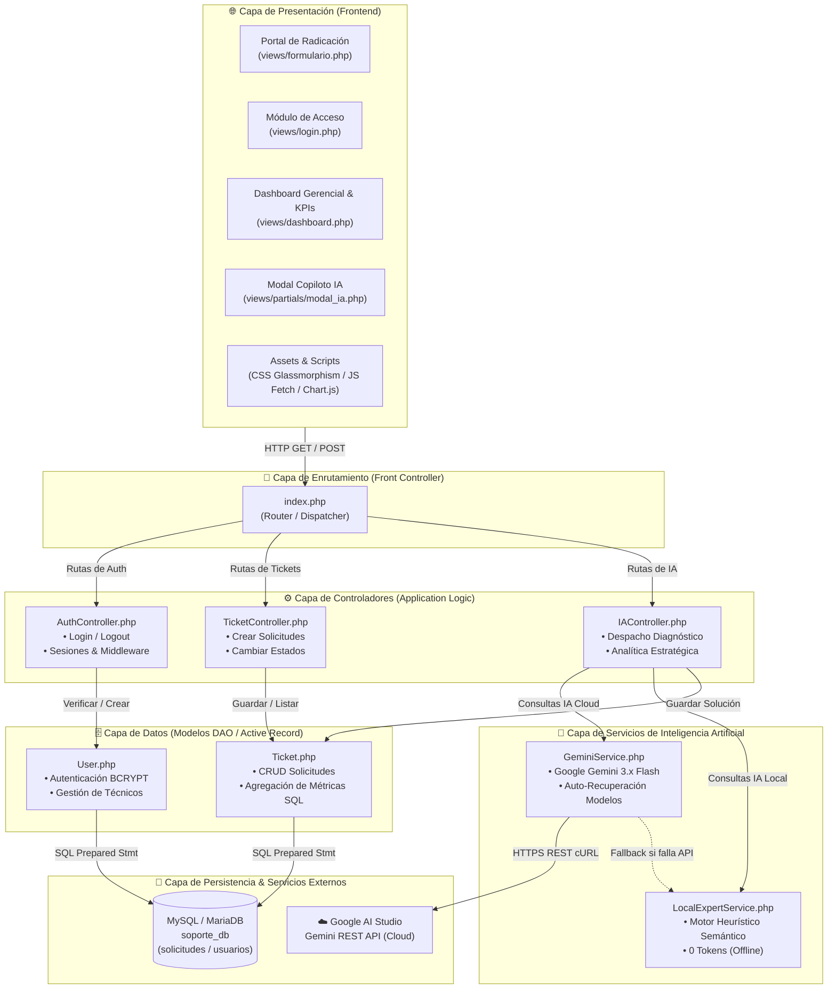
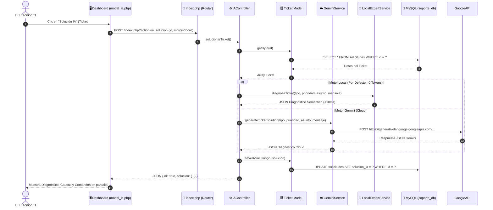

# 🏛️ Diagrama de Arquitectura del Sistema TechCare Soporte TI
**Proyecto:** TechCare Soporte TI — Mesa de Ayuda Inteligente con IA Generativa y Analítica Predictiva  
**Patrón Arquitectónico:** MVC (Modelo - Vista - Controlador) + Capa de Servicios Híbrida (Cloud / Local)  
**Versión:** 2.1.0  

---

## 1. Diagrama de Arquitectura de Capas (Mermaid)

Este diagrama representa cómo interactúan las capas de la aplicación, desde la interfaz de usuario hasta los motores de inteligencia artificial y la base de datos:

---

## 2. Descripción de Componentes por Capa

### A. Capa de Presentación (Frontend)
* **Tecnologías:** HTML5 semántico, CSS3 personalizado con efectos Glassmorphism, Bootstrap 5.3, Bootstrap Icons y Chart.js 4.4.
* **Componentes:**
  * `formulario.php`: Portal público y accesible para que cualquier usuario reporte una incidencia técnica.
  * `login.php`: Control de acceso administrativo con autenticación asíncrona.
  * `dashboard.php`: Panel directivo con 6 tarjetas KPIs, gráficos dinámicos y tabla interactiva de solicitudes.
  * `modal_ia.php`: Ventana modal para ver planes de acción técnicos, comandos sugeridos y alternar entre modo Cloud y Local.

### B. Capa de Enrutamiento y Controladores (Backend)
* **`index.php` (Front Controller):** Punto único de entrada. Centraliza la recepción de todas las peticiones web y las despacha al controlador correspondiente según el parámetro `route` o `action`.
* **`AuthController`:** Valida credenciales, inicializa sesiones seguras de PHP (`$_SESSION`) y actúa como **Middleware** (`requireAuth()`) para bloquear accesos no autorizados al dashboard y a la API.
* **`TicketController`:** Valida la integridad de los datos de entrada, previene inyecciones y coordina el ciclo de vida de los tickets (`pendiente` ➔ `en_proceso` ➔ `resuelto`).
* **`IAController`:** Determina si la petición de diagnóstico o análisis directivo debe ejecutarse a través de Google Gemini Cloud o el Motor Heurístico Local.

### C. Capa de Servicios de IA (Arquitectura Híbrida)
* **`GeminiService` (Cloud):** Se comunica vía cURL con la API de Google Generative Language (`gemini-3.7-flash` / `gemini-3.1-pro-preview`) enviando prompts contextualizados y procesando respuestas estrictas en JSON.
* **`LocalExpertService` (Offline / 0 Tokens):** Motor de reglas expertas con analizador semántico de palabras clave (NLP) que reconoce 7 sub-dominios (M365, VPN, Seguridad, Bases de Datos, Servidores, Hardware, Software). Provee respuestas en < 10 ms sin costo de API.
* **Mecanismo de Resiliencia (*Fallback*):** Si la API de Google presenta latencia o cuota agotada, el sistema conmuta automáticamente al motor local sin interrumpir la operación.

### D. Capa de Modelos y Datos
* **`Ticket` & `User`:** Encapsulan todas las consultas SQL mediante sentencias preparadas (`prepared statements`) con `mysqli` sobre la base de datos `soporte_db`.

---

## 3. Diagrama de Secuencia: Diagnóstico de Ticket con IA

