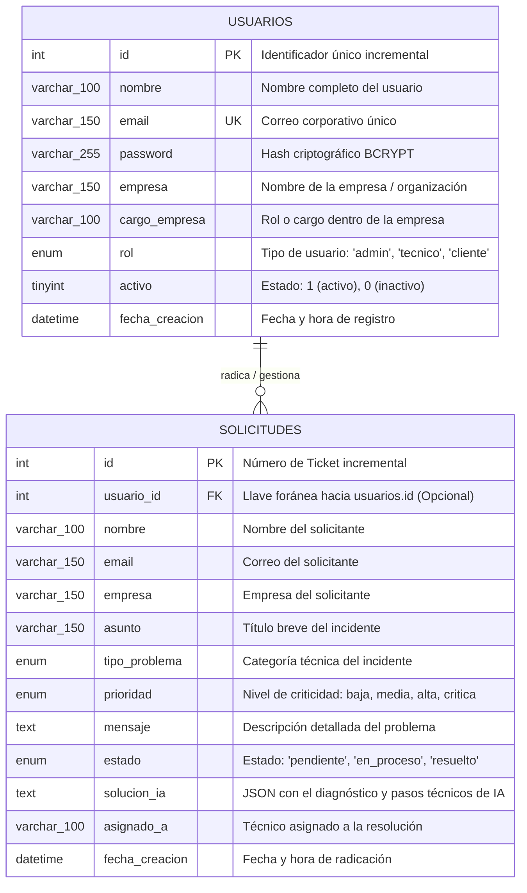

# 🗄️ Diagrama Entidad - Relación (DER) & Modelo de Datos
**Proyecto:** TechCare Soporte TI — Mesa de Ayuda Inteligente  
**Base de Datos:** MySQL / MariaDB (`soporte_db`)  
**Motor de Almacenamiento:** InnoDB (`utf8mb4_unicode_ci`)  
**Versión:** 2.2.0  

---

## 1. Diagrama Entidad - Relación (Mermaid ERD)

Este diagrama representa la estructura lógica de los datos, los atributos principales y las relaciones entre los usuarios registrados (clientes y administradores) y las solicitudes de soporte técnico:

---

## 2. Diccionario de Datos

### Tabla: `usuarios`
Almacena las cuentas tanto de los **Usuarios Clientes** (que radican y consultan el historial de sus solicitudes) como de los **Técnicos y Administradores** (que gestionan el dashboard y la IA).

| Campo | Tipo de Dato | Nulo | Llave | Valor por Defecto | Descripción |
| :--- | :--- | :---: | :---: | :---: | :--- |
| **`id`** | `INT AUTO_INCREMENT` | NO | **PK** | *Auto* | Identificador único del usuario. |
| **`nombre`** | `VARCHAR(100)` | NO | &mdash; | &mdash; | Nombre y apellidos del usuario. |
| **`email`** | `VARCHAR(150)` | NO | **UNIQUE** | &mdash; | Correo electrónico corporativo (usado para login). |
| **`password`** | `VARCHAR(255)` | NO | &mdash; | &mdash; | Hash seguro generado con algoritmo BCRYPT (`password_hash`). |
| **`empresa`** | `VARCHAR(150)` | SÍ | &mdash; | `NULL` | Nombre de la empresa u organización del usuario. |
| **`cargo_empresa`** | `VARCHAR(100)` | SÍ | &mdash; | `NULL` | Cargo / Rol que desempeña en su empresa (ej. Contador, Director de Operaciones). |
| **`rol`** | `ENUM('admin', 'tecnico', 'cliente')` | NO | &mdash; | `'cliente'` | Nivel de permisos: `cliente` (radicación e historial), `admin`/`tecnico` (gestión y analítica IA). |
| **`activo`** | `TINYINT(1)` | SÍ | &mdash; | `1` | `1` = Usuario habilitado, `0` = Usuario deshabilitado. |
| **`fecha_creacion`** | `DATETIME` | SÍ | &mdash; | `CURRENT_TIMESTAMP` | Momento exacto del alta en el sistema. |

---

### Tabla: `solicitudes`
Almacena todos los incidentes técnicos y tickets reportados por los usuarios, junto con su estado y la solución diagnóstica de IA.

| Campo | Tipo de Dato | Nulo | Llave | Valor por Defecto | Descripción |
| :--- | :--- | :---: | :---: | :---: | :--- |
| **`id`** | `INT AUTO_INCREMENT` | NO | **PK** | *Auto* | Número de ticket de soporte técnico. |
| **`usuario_id`** | `INT` | SÍ | **FK** | `NULL` | Referencia al usuario registrado que radicó la solicitud (`usuarios.id`). |
| **`nombre`** | `VARCHAR(100)` | NO | &mdash; | &mdash; | Nombre de la persona que reporta el fallo. |
| **`email`** | `VARCHAR(150)` | NO | &mdash; | &mdash; | Correo electrónico de contacto del solicitante. |
| **`empresa`** | `VARCHAR(150)` | SÍ | &mdash; | `NULL` | Empresa u organización a la que pertenece el solicitante. |
| **`asunto`** | `VARCHAR(150)` | NO | &mdash; | &mdash; | Título descriptivo del problema reportado. |
| **`tipo_problema`** | `ENUM('RED', 'SOFTWARE', 'HARDWARE', 'SEGURIDAD', 'CLOUD_SERVIDORES', 'BASE_DE_DATOS')` | NO | &mdash; | `'SOFTWARE'` | Clasificación por especialidad técnica. |
| **`prioridad`** | `ENUM('baja', 'media', 'alta', 'critica')` | NO | &mdash; | `'media'` | Nivel de urgencia e impacto operativo. |
| **`mensaje`** | `TEXT` | NO | &mdash; | &mdash; | Descripción detallada de síntomas y errores en pantalla. |
| **`estado`** | `ENUM('pendiente', 'en_proceso', 'resuelto')` | SÍ | &mdash; | `'pendiente'` | Ciclo de vida y progreso del ticket. |
| **`solucion_ia`** | `TEXT` | SÍ | &mdash; | `NULL` | Estructura JSON con diagnóstico, causas raíz, pasos y comandos generados por la IA. |
| **`asignado_a`** | `VARCHAR(100)` | SÍ | &mdash; | `NULL` | Técnico o departamento a cargo de la resolución. |
| **`fecha_creacion`** | `DATETIME` | SÍ | &mdash; | `CURRENT_TIMESTAMP` | Fecha y hora en que se radicó la solicitud. |
