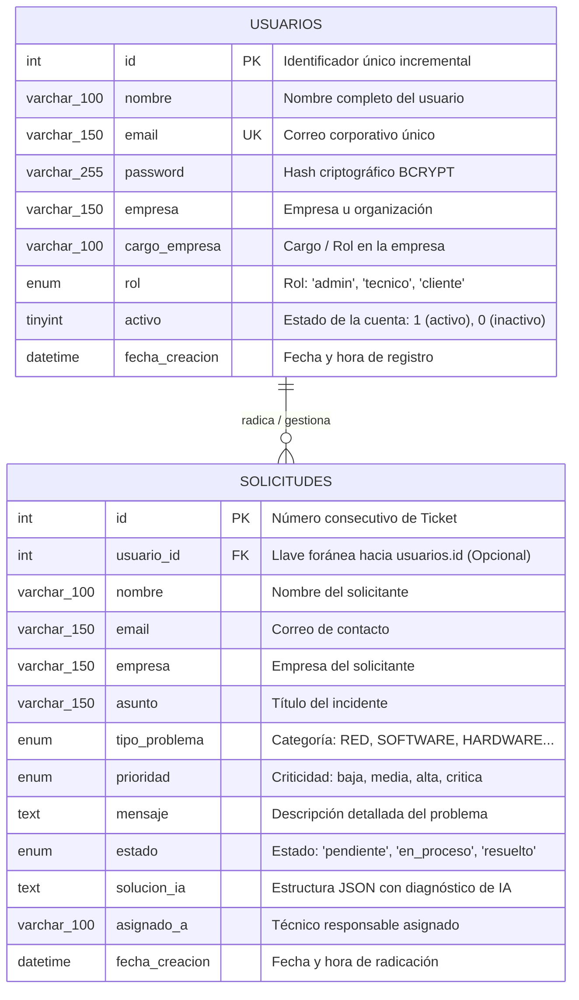

# 🗄️ Diagrama Entidad - Relación (DER)
**Proyecto:** TechCare Soporte TI — Mesa de Ayuda Inteligente  
**Base de Datos:** MySQL / MariaDB (`soporte_db`)  
**Versión:** 2.2.0  

---

## 1. Diagrama Entidad - Relación (Mermaid ERD)

Este diagrama representa el modelo conceptual y lógico de datos de la plataforma, detallando las entidades, sus atributos clave y la cardinalidad de la relación entre usuarios y solicitudes de soporte:

---

## 2. Descripción de Entidades y Cardinalidad

### 2.1. Entidad: `USUARIOS`
* Representa a todos los actores del sistema clasificados por su atributo `rol`:
  * **Usuarios Clientes (`cliente`):** Empleados o colaboradores externos que reportan incidentes y consultan el historial de sus tickets.
  * **Técnicos de Soporte (`tecnico`):** Personal operativo que atiende y resuelve solicitudes.
  * **Administradores TI (`admin`):** Directores y jefes de tecnología con acceso al Dashboard gerencial, KPIs y módulo de decisiones estratégicas de IA.

### 2.2. Entidad: `SOLICITUDES`
* Representa los tickets o incidencias de soporte técnico registradas en la mesa de ayuda.
* Cada solicitud almacena la clasificación del problema, el nivel de criticidad, el estado de resolución y el diagnóstico automático generado por **Google Gemini** o el **Motor Experto Local**.

### 2.3. Cardinalidad de la Relación
* **`USUARIOS (1) ──── (0..N) SOLICITUDES`**
* **Interpretación:**
  * Un usuario registrado puede radicar **cero o muchas (0..N)** solicitudes de soporte a lo largo del tiempo.
  * Una solicitud de soporte pertenece opcionalmente a **un único (0..1)** usuario registrado (`usuario_id`), permitiendo también el registro anónimo si la configuración pública lo requiere.

---

## 3. Modelo Relacional Lógico (Esquema de Tablas)

* **`USUARIOS`** (<u>id</u>, nombre, email, password, empresa, cargo_empresa, rol, activo, fecha_creacion)
  * **PK:** `id`
  * **UK:** `email`

* **`SOLICITUDES`** (<u>id</u>, *usuario_id*, nombre, email, empresa, asunto, tipo_problema, prioridad, mensaje, estado, solucion_ia, asignado_a, fecha_creacion)
  * **PK:** `id`
  * **FK:** `usuario_id` $\rightarrow$ `USUARIOS(id)` (ON DELETE SET NULL)

---

## 4. Diccionario de Datos Completo
Para consultar la definición detallada de cada columna, tipos de datos SQL, longitudes, restricciones de nulidad y valores por defecto, consulte el documento:  
👉 **[Diccionario de Datos Detallado](Diccionario_de_Datos.md)**
