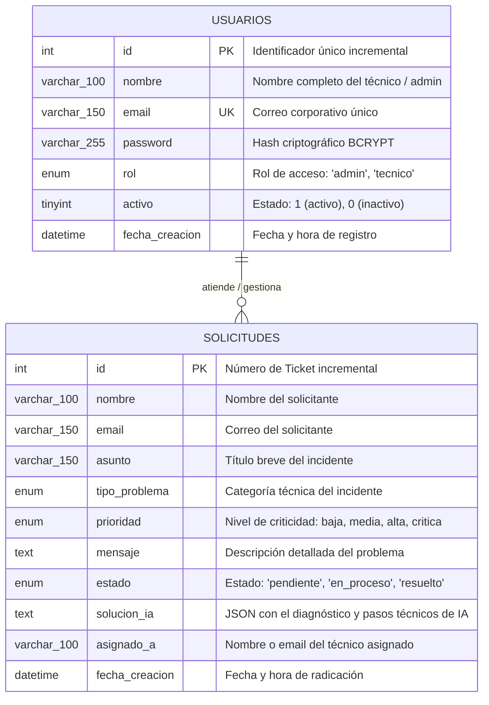

# 🗄️ Diagrama Entidad - Relación (DER) & Modelo de Datos
**Proyecto:** TechCare Soporte TI — Mesa de Ayuda Inteligente  
**Base de Datos:** MySQL / MariaDB (`soporte_db`)  
**Motor de Almacenamiento:** InnoDB (`utf8mb4_unicode_ci`)  
**Versión:** 2.1.0  

---

## 1. Diagrama Entidad - Relación (Mermaid ERD)

Este diagrama representa la estructura lógica de los datos, los atributos principales y las relaciones entre los usuarios del sistema y las solicitudes de soporte técnico:



---

## 2. Diccionario de Datos

### Tabla: `usuarios`
Almacena los datos de los técnicos de soporte e ingenieros administradores autorizados para ingresar al Dashboard y ejecutar diagnósticos con IA.

| Campo | Tipo de Dato | Nulo | Llave | Valor por Defecto | Descripción |
| :--- | :--- | :---: | :---: | :---: | :--- |
| **`id`** | `INT AUTO_INCREMENT` | NO | **PK** | *Auto* | Identificador único del usuario. |
| **`nombre`** | `VARCHAR(100)` | NO | &mdash; | &mdash; | Nombre y apellidos del técnico/administrador. |
| **`email`** | `VARCHAR(150)` | NO | **UNIQUE** | &mdash; | Correo electrónico corporativo (usado para login). |
| **`password`** | `VARCHAR(255)` | NO | &mdash; | &mdash; | Hash seguro generado con algoritmo BCRYPT (`password_hash`). |
| **`rol`** | `ENUM('admin', 'tecnico')` | NO | &mdash; | `'admin'` | Nivel de privilegios dentro del sistema. |
| **`activo`** | `TINYINT(1)` | SÍ | &mdash; | `1` | `1` = Usuario habilitado, `0` = Usuario deshabilitado. |
| **`fecha_creacion`** | `DATETIME` | SÍ | &mdash; | `CURRENT_TIMESTAMP` | Momento exacto del alta en el sistema. |

---

### Tabla: `solicitudes`
Almacena todos los incidentes técnicos y tickets reportados por los usuarios, junto con su estado y la solución diagnóstica de IA.

| Campo | Tipo de Dato | Nulo | Llave | Valor por Defecto | Descripción |
| :--- | :--- | :---: | :---: | :---: | :--- |
| **`id`** | `INT AUTO_INCREMENT` | NO | **PK** | *Auto* | Número de ticket de soporte técnico. |
| **`nombre`** | `VARCHAR(100)` | NO | &mdash; | &mdash; | Nombre de la persona que reporta el fallo. |
| **`email`** | `VARCHAR(150)` | NO | &mdash; | &mdash; | Correo electrónico de contacto del solicitante. |
| **`asunto`** | `VARCHAR(150)` | NO | &mdash; | &mdash; | Título descriptivo del problema reportado. |
| **`tipo_problema`** | `ENUM('RED', 'SOFTWARE', 'HARDWARE', 'SEGURIDAD', 'CLOUD_SERVIDORES', 'BASE_DE_DATOS')` | NO | &mdash; | `'SOFTWARE'` | Clasificación por especialidad técnica. |
| **`prioridad`** | `ENUM('baja', 'media', 'alta', 'critica')` | NO | &mdash; | `'media'` | Nivel de urgencia e impacto operativo. |
| **`mensaje`** | `TEXT` | NO | &mdash; | &mdash; | Descripción detallada de síntomas y errores en pantalla. |
| **`estado`** | `ENUM('pendiente', 'en_proceso', 'resuelto')` | SÍ | &mdash; | `'pendiente'` | Ciclo de vida y progreso del ticket. |
| **`solucion_ia`** | `TEXT` | SÍ | &mdash; | `NULL` | Estructura JSON con diagnóstico, causas raíz, pasos y comandos generados por la IA. |
| **`asignado_a`** | `VARCHAR(100)` | SÍ | &mdash; | `NULL` | Técnico o departamento a cargo de la resolución. |
| **`fecha_creacion`** | `DATETIME` | SÍ | &mdash; | `CURRENT_TIMESTAMP` | Fecha y hora en que se radicó la solicitud. |

---

## 3. Estructura del Objeto JSON en `solucion_ia`

El campo `solucion_ia` almacena un documento JSON enriquecido tanto por **Google Gemini** como por el **Motor Experto Local**:

```json
{
  "enfoque_nombre": "Solución Rápida en Caliente & Mitigación Inmediata (N1/N2)",
  "categoria": "Microsoft 365 & Licenciamiento Cloud",
  "diagnostico": "Explicación técnica detallada del fallo detectado...",
  "causa_probable": "1. Causa A. 2. Causa B. 3. Causa C.",
  "tiempo_estimado": "10 - 20 minutos",
  "pasos_resolucion": [
    "Paso 1: Detalle de la acción...",
    "Paso 2: Detalle de la acción...",
    "Paso 3: Detalle de la acción..."
  ],
  "comandos_herramientas": [
    "cscript OSPP.VBS /dstatus",
    "dsregcmd /status"
  ],
  "accion_preventiva": "Medida para evitar recurrencias futuras...",
  "motor_ia": "Google Gemini 3.7 Flash (Cloud)",
  "variante_index": 1,
  "fecha_generacion": "15:30:12"
}
```

---

## 4. Reglas de Integridad y Negocio

1. **Unicidad de Cuenta (`UNIQUE email`):** No se permiten duplicados en el correo de acceso administrativo.
2. **Seguridad de Credenciales:** Las contraseñas nunca se almacenan en texto plano; se utiliza la función nativa `password_hash()` con costo criptográfico de BCRYPT.
3. **Persistencia de Estados:** La columna `estado` solo acepta los valores estandarizados (`pendiente`, `en_proceso`, `resuelto`), asegurando consistencia en los KPIs de la mesa de ayuda.
4. **Caché Inteligente de IA:** Cuando un ticket ya tiene una `solucion_ia` almacenada en base de datos, el sistema la sirve de forma instantánea sin recalcular ni gastar tokens adicionales, a menos que el técnico solicite explícitamente una regeneración.
