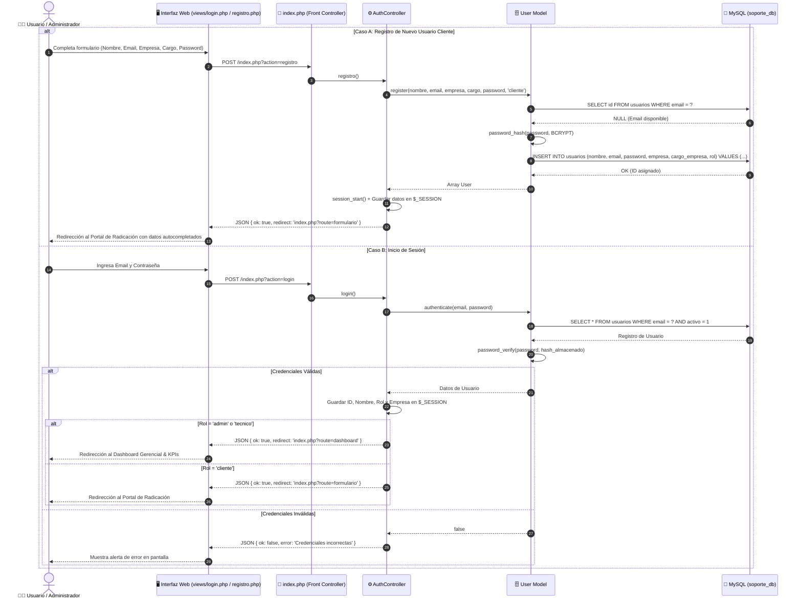
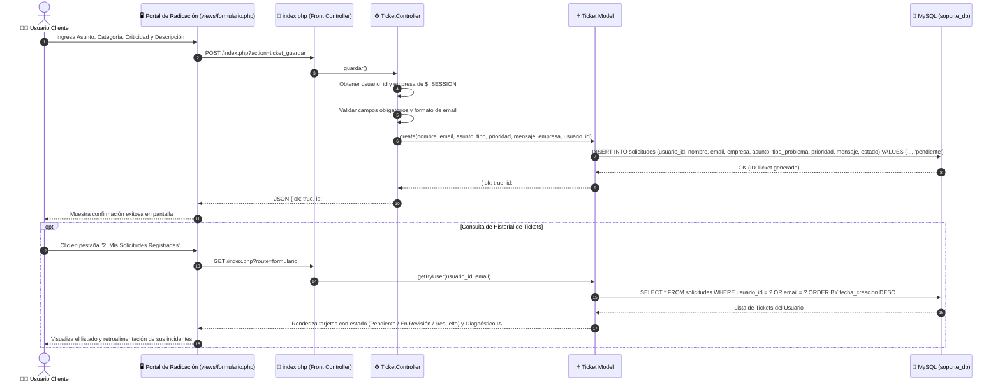
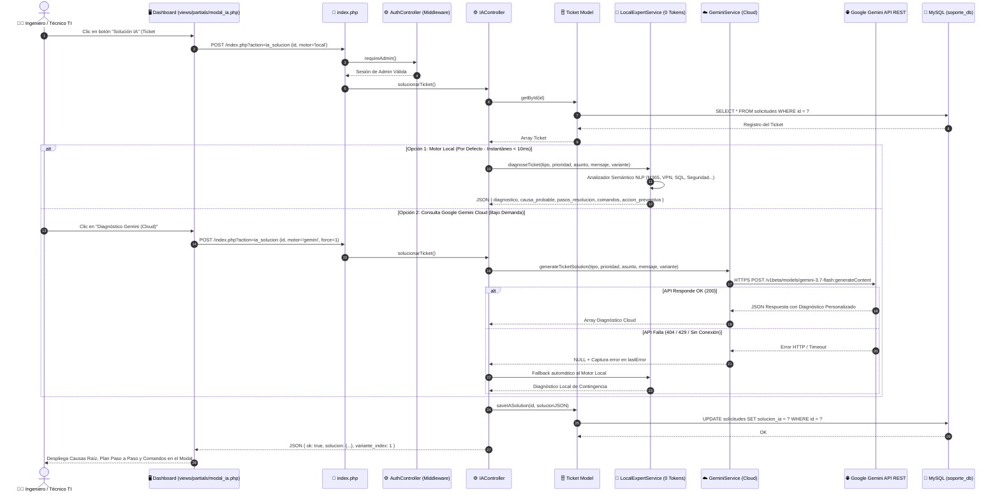
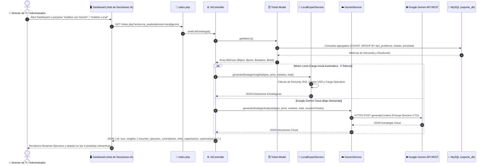
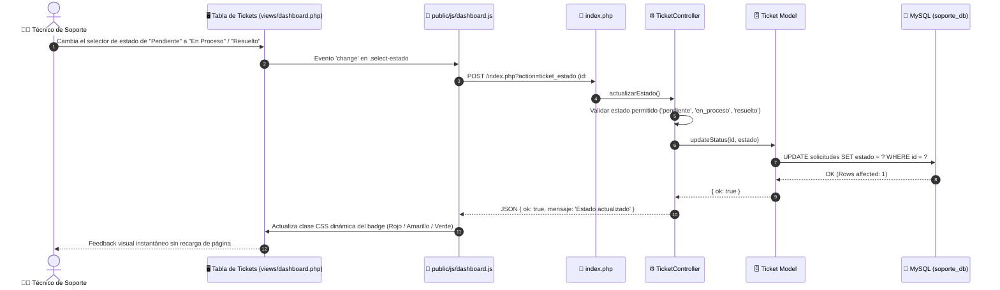

# 🔄 Diagramas de Secuencia del Sistema TechCare Soporte TI
**Proyecto:** TechCare Soporte TI — Mesa de Ayuda Inteligente con IA  
**Estándar:** UML 2.5 (Mermaid Sequence Diagrams)  
**Versión:** 2.2.0  

---

## 1. Introducción
Este documento especifica la dinámica temporal y el intercambio de mensajes entre los diferentes actores, capas del sistema (Vistas, Controladores, Modelos, Servicios de Inteligencia Artificial) y la base de datos MySQL para los 5 flujos operativos principales de la plataforma.

---

## 2. Catálogo de Diagramas de Secuencia

1. **[Flujo 1: Registro y Autenticación de Usuarios (Control de Acceso RBAC)](#flujo-1-registro-y-autenticaci%C3%B3n-de-usuarios-rbac)**
2. **[Flujo 2: Radicación de Incidente Técnico y Consulta de Historial](#flujo-2-radicaci%C3%B3n-de-incidente-t%C3%A9cnico-y-consulta-de-historial)**
3. **[Flujo 3: Diagnóstico Técnico Asistido por IA (Modo Híbrido: Local / Gemini Cloud)](#flujo-3-diagn%C3%B3stico-t%C3%A9cnico-asistido-por-ia-modo-h%C3%ADbrido)**
4. **[Flujo 4: Análisis Estratégico Directivo y Prescripción de Decisiones TI](#flujo-4-an%C3%A1lisis-estrat%C3%A9gico-directivo-y-toma-de-decisiones-ti)**
5. **[Flujo 5: Gestión Asíncrona de Estados de Tickets (AJAX)](#flujo-5-gesti%C3%B3n-as%C3%ADncrona-de-estados-de-tickets-ajax)**

---

## Flujo 1: Registro y Autenticación de Usuarios (RBAC)
Describe cómo un usuario cliente crea su cuenta con su empresa y cargo, y cómo el sistema valida las credenciales redirigiendo según su rol (`cliente` al formulario o `admin` al dashboard).

---

## Flujo 2: Radicación de Incidente Técnico y Consulta de Historial
Describe el proceso mediante el cual un usuario cliente envía una solicitud técnica, cómo se vincula a su cuenta y empresa, y cómo consulta el progreso en su historial.

---

## Flujo 3: Diagnóstico Técnico Asistido por IA (Modo Híbrido)
Detalla la generación de soluciones técnicas paso a paso, alternando entre el **Motor Local Experto (0 Tokens / Instantáneo)** y **Google Gemini Cloud API (Bajo Demanda)**.

---

## Flujo 4: Análisis Estratégico Directivo y Toma de Decisiones TI
Muestra cómo el sistema agrega las estadísticas de incidentes de toda la empresa y genera recomendaciones ejecutivas de contratación, inversión en infraestructura y capacitaciones.

---

## Flujo 5: Gestión Asíncrona de Estados de Tickets (AJAX)
Describe la actualización en caliente del estado de un ticket (`pendiente` ➔ `en_proceso` ➔ `resuelto`) desde la tabla del dashboard sin recargar la página web.

