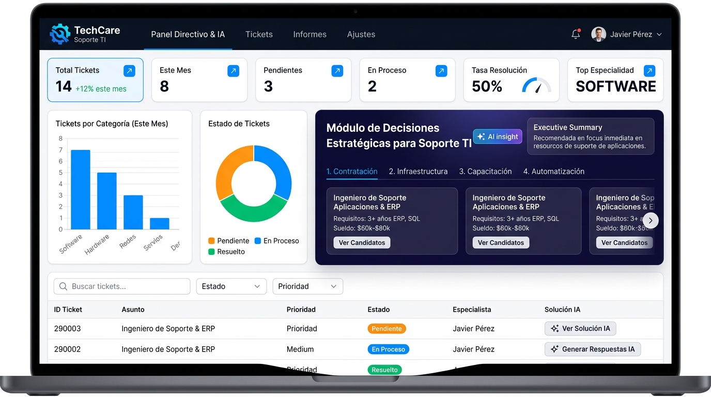
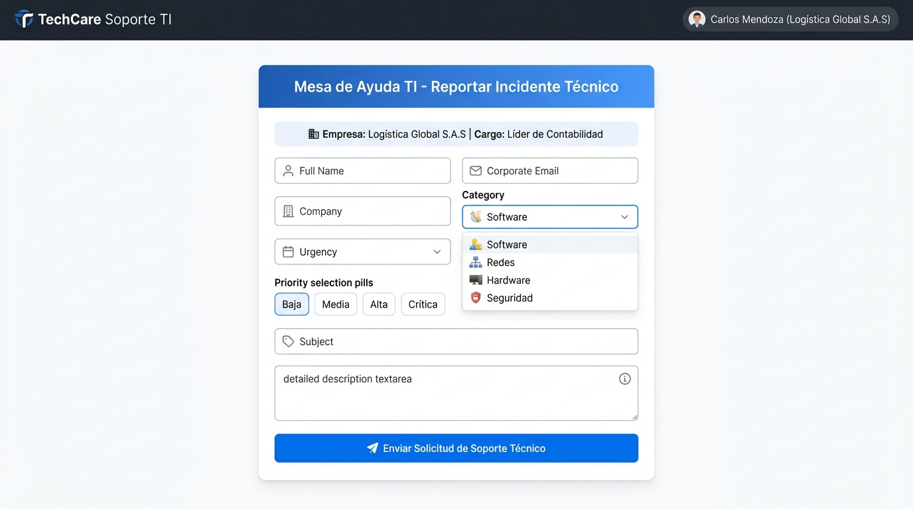
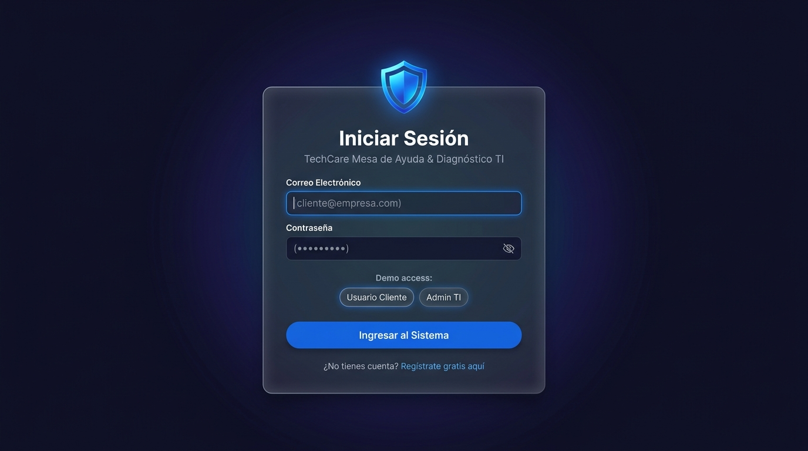
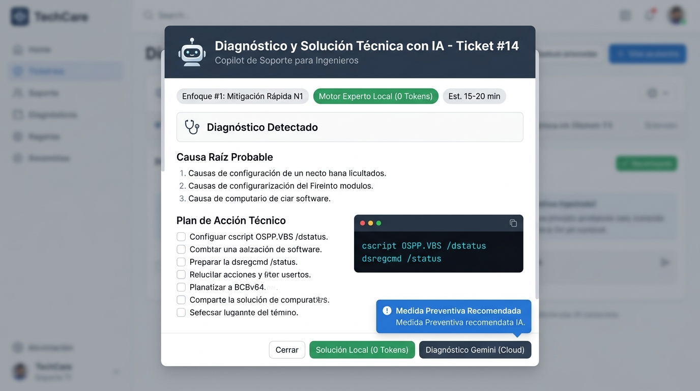

# 🎨 Mockups y Diseño de Interfaz de Usuario (UI/UX)
**Proyecto:** TechCare Soporte TI — Mesa de Ayuda Inteligente con IA  
**Enfoque de Diseño:** Glassmorphism Moderno, Clean Dark/Light Mode & Responsive Design  
**Framework Frontend:** Bootstrap 5.3 + Bootstrap Icons + Chart.js 4.4 + Google Fonts (Inter)  
**Versión:** 2.2.0  

---

## 1. Guía de Estilos y Sistema de Diseño (Design System)

### 1.1. Paleta de Colores Corporativa

| Token de Color | Código Hex | Muestra Visual | Uso Principal |
| :--- | :---: | :---: | :--- |
| **`Primary Blue`** | `#4361ee` | 🟦 | Botones primarios, enlaces activos, badges de software. |
| **`Dark Indigo (Hub)`** | `#0f172a` ➔ `#1e1b4b` | ⬛ | Fondo del Hub de Decisiones IA, Navbar y Terminal de comandos. |
| **`Background Light`** | `#f8fafc` | ⬜ | Fondo general del portal y dashboard en modo diurno. |
| **`Card Glass Border`** | `rgba(255,255,255,0.12)` | ◽ | Bordes con efecto traslúcido y desenfoque (*backdrop-filter*). |
| **`Success Green`** | `#10b981` | 🟩 | Estado *Resuelto*, tasa de resolución, badges de impacto positivo. |
| **`Warning Orange`** | `#f59e0b` | 🟧 | Estado *En Proceso*, prioridad alta, avisos de infraestructura. |
| **`Danger Red`** | `#ef4444` | 🟥 | Estado *Pendiente*, prioridad crítica, alertas de ciberseguridad. |
| **`Info Cyan`** | `#06b6d4` | 🔷 | Badges de Redes/VPN, comandos de consola, dictamen de IA. |

### 1.2. Tipografía Oficial
* **Familia Tipográfica:** [Inter (Google Fonts)](https://fonts.google.com/specimen/Inter)
* **Pesos Utilizados:** `300 (Light)`, `400 (Regular)`, `500 (Medium)`, `600 (SemiBold)`, `700 (Bold)`, `800 (ExtraBold)`.
* **Fuente Monospace:** `Consolas`, `'Courier New'`, `monospace` (para comandos de consola y scripts).

---

## 2. Galería Visual de Mockups de la Aplicación

---

### 🖥️ Mockup 1: Dashboard Gerencial & Hub de Decisiones IA (`views/dashboard.php`)
Panel directivo con 6 tarjetas KPIs, gráficos dinámicos en tiempo real con Chart.js, Hub prescriptivo con IA y tabla de solicitudes.



```text
+-----------------------------------------------------------------------------------------------+
| [🛡️ TechCare Soporte TI]  [Radicar Ticket]  [📊 Dashboard & IA]  [👤 Admin: Jaider B.] [Salir] |
+-----------------------------------------------------------------------------------------------+
|  Panel de Control Gerencial & Decisiones IA    [✨ Análisis con Gemini] [⚡ Análisis Local]   |
|  [Total Tickets: 14] [Este Mes: 14] [Pendientes: 3] [En Proceso: 2] [Resolución: 50%] [Top: SOFT]
|                                                                                               |
|  +--[ HUB DE TOMA DE DECISIONES ESTRATÉGICAS CON IA (CTO PRESCRIPTIVO) ]--------------------+  |
|  | 🤖 Dictamen: Demanda concentrada en Software (42.8%). Se recomienda contratar 1 esp. L2  |  |
|  | [ (•) 1. Contratación ] [ ( ) 2. Infraestructura ] [ ( ) 3. Capacitación ] [ ( ) 4. Auto]|  |
|  +------------------------------------------------------------------------------------------+  |
|  +--[ GRÁFICAS CHART.JS: Barras Mensuales & Donut de Especialidades ]-----------------------+  |
|  +--[ TABLA DE TICKETS: ID, Fecha, Solicitante, Asunto, Criticidad, Estado y Solución IA ]----+ |
+-----------------------------------------------------------------------------------------------+
```

---

### 📝 Mockup 2: Portal de Radicación de Incidentes (`views/formulario.php`)
Formulario web corporativo con autocompletado inteligente de empresa y cargo del usuario conectado, selector de categorías y prioridades.



```text
+-----------------------------------------------------------------------------------------------+
|   +---------------------------------------------------------------------------------------+   |
|   |                       MESA DE AYUDA TI — REPORTAR INCIDENTE TÉCNICO                   |   |
|   |       🏢 Empresa: Logística Global S.A.S   |   💼 Cargo: Líder de Contabilidad       |   |
|   +---------------------------------------------------------------------------------------+   |
|   |   Nombre: [ 👤 Carlos Mendoza ]           Correo: [ ✉️ cliente@empresa.com ]          |   |
|   |   Empresa: [ 🏢 Logística Global S.A.S ]  Categoría: [ 💻 Software & Aplicaciones v ] |   |
|   |   Criticidad: [ 🟡 Media (Problema individual manejable)                            ] |   |
|   |   Asunto: [ Ej. Aviso de expiración de licencia Microsoft 365                       ] |   |
|   |   Descripción: [ Descripción detallada de síntomas y capturas...                    ] |   |
|   |                                                                                       |   |
|   |                  [ 🚀 ENVIAR SOLICITUD DE SOPORTE TÉCNICO ]                           |   |
|   +---------------------------------------------------------------------------------------+   |
+-----------------------------------------------------------------------------------------------+
```

---

### 🔐 Mockup 3: Módulo de Inicio de Sesión (`views/login.php`)
Control de acceso con tarjeta flotante Glassmorphism sobre fondo Dark Indigo, visibilidad de clave interactiva y accesos demo rápidos.



```text
+-----------------------------------------------------------------------------------------------+
|                               +-------------------------------+                               |
|                               |       [ 🛡️ TechCare TI ]       |                               |
|                               |     Acceso Administrativo     |                               |
|                               |   Mesa de Ayuda & Diagnóstico |                               |
|                               +-------------------------------+                               |
|                               | Correo: [ ✉️ cliente@empresa.com ]                            |
|                               | Contraseña: [ 🔑 •••••••••••• 👁️ ]                           |
|                               | 🪄 Demo: [ 👤 Usuario Cliente ] [ 🛡️ Admin TI ]               |
|                               | [ 🔓 INGRESAR AL SISTEMA ]                                    |
|                               | ¿No tienes cuenta? 👉 [Regístrate gratis aquí]                |
|                               +-------------------------------+                               |
+-----------------------------------------------------------------------------------------------+
```

---

### 🤖 Mockup 4: Modal Copiloto de Diagnóstico Técnico IA (`views/partials/modal_ia.php`)
Ventana emergente que desglosa el diagnóstico forense, causas raíz, checklist paso a paso y terminal de comandos.



```text
+-----------------------------------------------------------------------------------------------+
|  [🤖 Diagnóstico y Solución Técnica con IA — Ticket #14]                                  [X] |
+-----------------------------------------------------------------------------------------------+
|  [✨ Enfoque #1: Mitigación Rápida N1]  [⚡ Motor Experto Local (0 Tokens)]  [⏱️ Est. 15-20 min]|
|                                                                                               |
|  🩺 Diagnóstico: Alerta de expiración de suscripción de Microsoft 365 en módulo de facturación|
|  🔍 Causa Raíz: 1. Desincronización de token OAuth. 2. Licencia pendiente de asignación.     |
|  📋 Plan de Acción: Checklist paso a paso para el técnico L1/L2.                              |
|  💻 Comandos Sugeridos: [ cscript OSPP.VBS /dstatus ] [ dsregcmd /status ]                    |
|  🛡️ Medida Preventiva: Configurar alertas automáticas de renovación con 30 días de anticipo.  |
|  ─────────────────────────────────────────────────────────────────────────────────────────── |
|  [ Cerrar ]                          [ ⚡ Solución Local (0 Tokens) ] [ ✨ Diagnóstico Gemini ] |
+-----------------------------------------------------------------------------------------------+
```

---

## 3. Principios de Experiencia de Usuario (UX) Implementados

1. **Jerarquía Visual Inmediata:** Uso de códigos de color estándar (Verde/Amarillo/Rojo) que permiten al equipo técnico clasificar urgencias en menos de 3 segundos.
2. **Operaciones Asíncronas (Sin Recarga):** Los cambios de estado de tickets y las consultas a la IA funcionan vía `fetch()` en segundo plano con indicadores de carga.
3. **Cero Fricción en Radicación:** Los usuarios autenticados disfrutan de autocompletado de empresa y cargo, reduciendo el tiempo de reporte en un 60%.
4. **Optimización de Consumo de Tokens:** El sistema ejecuta por defecto el motor local instantáneo y solo invoca a Google Gemini Cloud bajo solicitud explícita del usuario.
