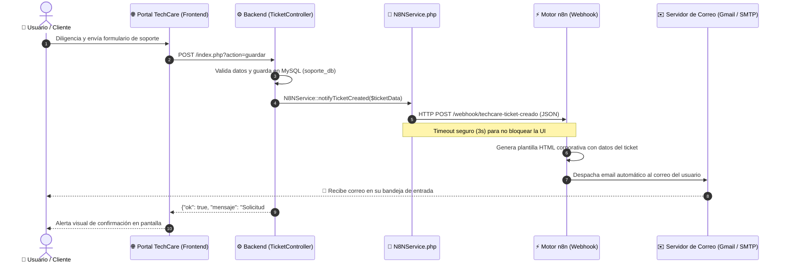

# ⚡ Integración de Automatización con n8n — TechCare Soporte TI
**Proyecto:** TechCare Soporte TI — Mesa de Ayuda Inteligente  
**Módulo:** Automatización de Notificaciones, Encuesta CSAT y Devolución Prioritaria  
**Desarrollador:** Jaider Augusto Niño Badillo  
**Versión:** 2.3.0  

---

## 🎯 Objetivo de la Integración

1. **Notificación de Recepción:** Enviar automáticamente un correo electrónico formal y personalizado al usuario en cuanto radica un ticket con su `#ID` y resumen del incidente.
2. **Notificación de Resolución con Encuesta CSAT:** Al resolver el ticket, notificar al usuario con botones interactivos de 1 clic para validar si el problema fue resuelto y calificar la atención (1 a 5 estrellas).
3. **Gestión Automática de Tickets Devueltos:** Si el usuario indica que la incidencia persiste, el sistema reabre el caso de inmediato, escala su prioridad a **Alta / Crítica** y alerta al equipo técnico vía n8n.

---

## 🏗️ Arquitectura de la Solución



---

## 📂 Archivos del Módulo

* 📄 **[`workflow_techcare_notificacion_tickets.json`](workflow_techcare_notificacion_tickets.json):** Flujo de trabajo listo para importar en n8n en 1 solo clic.
* ⚙️ **[`03-Desarrollo/src/Services/N8NService.php`](../03-Desarrollo/src/Services/N8NService.php):** Servicio backend encargado de emitir los webhooks de manera segura y asíncrona mediante cURL.
* 🎛️ **[`03-Desarrollo/config/config.php`](../03-Desarrollo/config/config.php):** Parámetros de activación y URL del Webhook.

---

## 🚀 Guía de Puesta en Marcha Paso a Paso

### Paso 1: Iniciar n8n en tu máquina

Si ya tienes **Node.js** instalado, puedes iniciar n8n inmediatamente desde cualquier terminal ejecutando:

```bash
npx n8n
```

*(O si utilizas Docker: `docker run -it --rm -p 5678:5678 n8nio/n8n`)*

Una vez iniciado, abre tu navegador e ingresa a:  
👉 **`http://localhost:5678`**

---

### Paso 2: Importar el Workflow en n8n (1 Clic)

1. En la interfaz de n8n, haz clic en el menú superior derecho (tres puntos `...`) o en el botón **"Add workflow"**.
2. Selecciona **"Import from file"** (Importar desde archivo).
3. Selecciona el archivo:  
   📁 `c:\Users\Jaider\Documents\Proyectos_antigravity\Soporte\n8n\workflow_techcare_notificacion_tickets.json`
4. Verás aparecer el flujo completo con 4 nodos:
   * **Webhook TechCare (Ticket Creado):** Escucha peticiones POST en `/webhook/techcare-ticket-creado`.
   * **Generar Plantilla HTML Email:** Da formato a un correo moderno y responsivo con el logo y colores de TechCare.
   * **Enviar Correo al Usuario:** Nodo de envío directo al email del usuario (`{{ $json.email }}`).
   * **Responder a TechCare:** Confirma el encolamiento exitoso.

---

### Paso 3: Configurar las Credenciales de Correo en n8n

En el nodo **"Enviar Correo al Usuario (SMTP / Gmail)"**:
1. Haz doble clic sobre el nodo.
2. En el campo **Credential to connect with**, haz clic en **"Create New Credential"**.
3. Si utilizas **Gmail**:
   * **User:** Tu correo Gmail (ej. `soporte.techcare@gmail.com`).
   * **Password:** Tu **Contraseña de Aplicación** de Google (generada en *Seguridad de tu Cuenta Google > Contraseñas de aplicaciones*).
   * **Host:** `smtp.gmail.com`
   * **Port:** `465` (SSL) o `587` (TLS).
4. Guarda las credenciales.
5. Haz clic en el botón superior **"Save"** y activa el interruptor **"Active"** (en verde) para que quede escuchando las 24 horas.

---

### Paso 4: Validar la Configuración en TechCare

En el archivo de configuración [`03-Desarrollo/config/config.php`](../03-Desarrollo/config/config.php), asegúrate de que el webhook se encuentre activo:

```php
// ==========================================
// Integración de Automatización con n8n
// ==========================================
define('N8N_WEBHOOK_ENABLED', true);
define('N8N_WEBHOOK_URL', 'http://localhost:5678/webhook/techcare-ticket-creado');
```

---

## 🧪 Cómo Probar la Solución

1. Inicia tu servidor local de TechCare (ejecutando `iniciar_servidor.bat` o `php -S 127.0.0.1:8000`).
2. Ve a la vista de radicación de solicitudes:  
   👉 `http://127.0.0.1:8000/index.php?action=formulario`
3. Diligencia un ticket con un correo real tuyo (por ejemplo: tu correo personal o corporativo).
4. Haz clic en **"Radicar Solicitud"**.
5. **¡Listo!**
   * En TechCare verás el mensaje de confirmación: *"Solicitud de soporte #ID registrada correctamente"*.
   * En n8n verás registrarse la ejecución en tiempo real en la pestaña **Executions**.
   * En tu bandeja de entrada recibirás el correo electrónico con el diseño oficial de TechCare, confirmando que tu ticket fue recibido y que el equipo de TI te contactará apenas quede resuelto.
